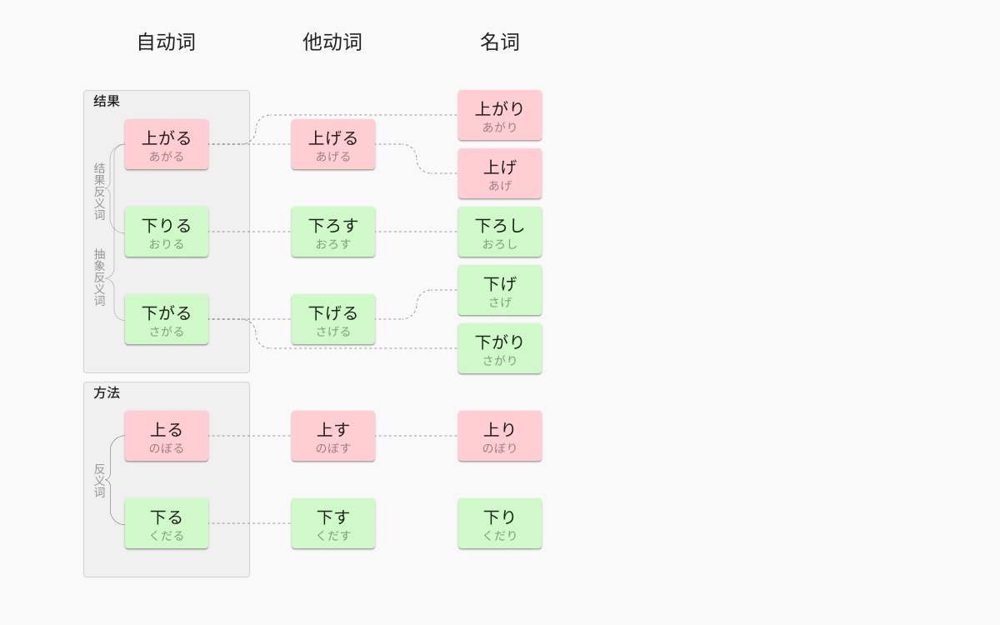

## 自動詞

### 上がる（あがる）

㊀〈（どこ**カラ**）どこ**ニ━**／どこ**ヲ━**〉△低い位置（下の方）から△高い位置（上の方）へ移った状態になる。〔（上の立場の）相手の△部屋に入る（家を訪問する）意にも用いられる〕

---
从较低位置转移到较高位置。

> 「あがる」は低い位置から高い位置に移動した結果に着目する表現に多く用いられる。これに対する逆方向の移動は一般に「おりる」が用いられる。

三省堂新明解国語辞典(第七版)　あがる・文法

㊁〈（なに**カラ**なに**ニ**）**━**〉程度や段階が今までより高い状態になる。

---
程度和阶段变得比以前高了。

> 人を含む物体・物質の移動については「あがる」も「のぼる」も用いられる（逆方向の移動は「さがる」 「おりる」 「くだる」）が、抽象的なもの、つまり、程度の変化については一般に「あがる」（逆方向の場合は「さがる」）しか用いられない。

三省堂新明解国語辞典(第七版)　あがる・文法

> 相対的な高低差を表わす場合には、「〔水平を保つべきものについて〕右の方が少し△あがっている（さがっている）」と「あがる」 「さがる」を用いる。

三省堂新明解国語辞典(第七版)　あがる・文法

⇨[上がり](#上がり（あがり）)

### 降りる・下りる（おりる）

㊀〈どこ**カラ**どこ**ニ━**／どこ**ヲ━**〉下の方へ向かって移動し、低い位置に到達する。

---
向下移动，到达较低的位置。

### 下がる（さがる）

㊀〈（どこ・なに**カラ**どこ・なに**ニ**）**━**／（どこ**ヲ**）**━**〉高い△位置（程度・段階）から低い△位置（程度・段階）へ移った状態になる。また、目立つ位置から目立たない位置へ移した状態になる。

---
从较高位置转移到较低位置

↔[あがる](#上がる（あがる）)

⇨[下がり](#下がり（さがり）)

### 上る（のぼる）

㊀〈（どこ・なに**カラ**）どこ・なに**ニ━**／（どこ・なに**カラ**）どこ・なに**ヲ━**〉\
Ⓐ〔斜面に沿うなどして〕低い位置から高い位置へ向かって移動する。\
Ⓑ川を下流から上流に向かって進む。\
Ⓒ地方から都へ行く。

---
〔沿着斜面等〕从低位置向高位置移动。

↔[くだる㊀](#下る（くだる）)・[おりる](#降りる・下りる（おりる）)

> 同じく低い位置から高い位置への移動を表わす「のぼる」は、多くの場合順路・経路に沿って移動するという移動のしかたにも着目した表現である。これに対する逆方向の移動は一般に「くだる」が用いられる。

三省堂新明解国語辞典(第七版)　あがる・文法

> 人を含む物体・物質の移動については「あがる」も「のぼる」も用いられる（逆方向の移動は「さがる」 「おりる」 「くだる」）が、抽象的なもの、つまり、程度の変化については一般に「あがる」（逆方向の場合は「さがる」）しか用いられない。

三省堂新明解国語辞典(第七版)　あがる・文法

⇨[上り](#上り（のぼり）)

### 下る（くだる）

㊀〈どこ**ヲ━**／（どこ・なに**ニ**）**━**〉〔斜面に沿うなどして〕高い位置から低い位置へ向かって移動する。〔広義では、川の上流から下流の方へ移ることや、昔、都から地方へ行ったことをも指す〕

---
〔沿着斜面等〕从高位置向低位置移动。

↔[のぼる](#上る（のぼる）)

⇨[下り](#下り（くだり）)

## 他動詞

### 上げる（あげる）

㊀〈（どこ**カラ**）どこ**ニ**なに**ヲ━**〉△低い位置（下の方）から△高い位置（上の方）へ何かを移す。〔客などを部屋に入れる意にも用いる〕

⇨[あがる](#上がるあがる)

⇨[あげ](#上げあげ)

### 下ろす（おろす）

㊀〈（どこ**カラ**）どこ**ニ**なに**ヲ━**〉高い所から下の方へ移す。

⇨[おりる](#降りる下りるおりる)

⇨[おろし](#下ろしおろし)

### 下げる（さげる）

㊀〈（どこ・なに**カラ**どこ・だれ**ニ**）なに**ヲ━**〉高い△位置（程度・段階）から低い△位置（程度・段階）へ何かを移す。また、目立つ位置から目立たない位置へ何かを移す。

⇨[さがる](#下がるさがる)

⇨[下げ](#下げさげ)

### 上す（のぼす）

「上ぼせる」のやや口頭語的表現。

⇨[のぼる](#上るのぼる)

### 下す（くだす）

㊀〈なに・だれ**ヲ**（なに・どこ**ニ**）**━**〉低い所に移す。

⇨[くだる](#下るくだる)

## 名詞

### 上がり（あがり）

㊀位置や程度が上がること。

動詞「[上がる](#上がるあがる)」の連用形。

### 上げ（あげ）

㊀[上げる](#上げるあげる)こと。

↔[さげ](#下げさげ)

### 下ろし（おろし）

㊀[おろす](#下ろすおろす)こと。

動詞「[下ろす](#下ろすおろす)」の連用形。

### 下がり（さがり）

㊀△[下がる](#下がるさがる)こと（下がった所）。

動詞「[下がる](#下がるさがる)」の連用形。

### 下げ（さげ）

㊀[下げる](#下げるさげる)こと。また、下げたもの。〔かぞえる時にも用いられる〕

↔[上げ](#上げあげ)

### 上り（のぼり）

㊀「[上る](#上るのぼる)㊀㊁」△こと（状態）。

㊁「上り坂・上り列車」の略。\
㊂〔乗り物や道路で〕終点（と定められている所）から起点（と定められている所）へ向かう△こと（もの・方向）。〔一般に、地方から中心都市へ、郊外から都心へ、または支線から幹線へ向かう△こと（もの・方向）を指す〕

㊁㊂↔[下り](#下りくだり)

動詞「[上る](#上るのぼる)」の連用形。

### 下り（くだり）

↔[のぼり](#上りのぼり)

㊀低い方へ移ること。

㊁〔乗り物や道路で〕起点（と定められている所）から終点（と定められている所）へ向かう△こと（もの・方向）。〔一般に、東京から他の地方へ、都心から市外へ、または幹線から支線へ向かう△こと（もの・方向）を指す〕

動詞「[下る](#下るくだる)」の連用形。

### 上（うえ）

### 上（うわ）

### 下（した）

### 上（かみ）

### 下（しも）

### 下（もと）

## 音読み

### 上（じょう）

### 下（か）

### 下（げ）
